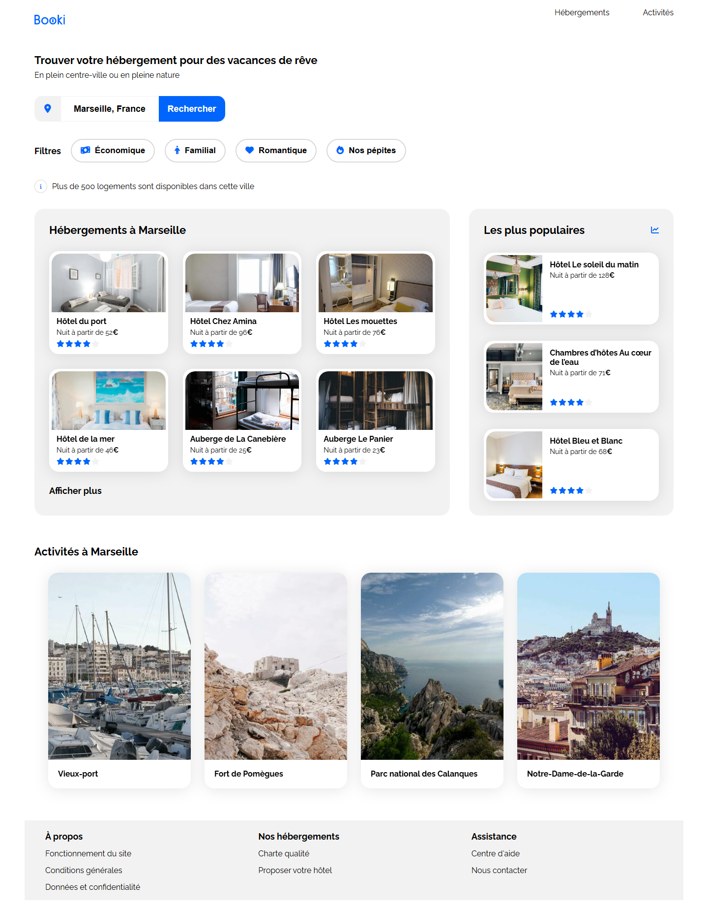
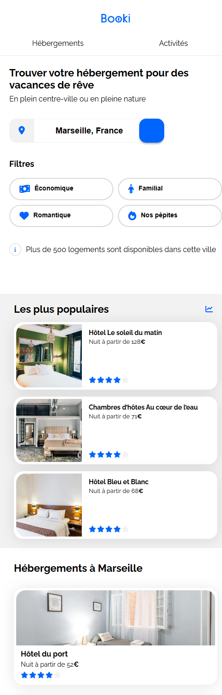

# Booki

Projet réalisé dans le cadre de la formation Développeur Web d'OpenClassrooms.

## Description

Booki est la page d'accueil d'une agence de voyage permettant aux utilisateurs de rechercher des hébergements et des activités dans différentes villes.

L'objectif de ce projet était d'intégrer une maquette Figma en HTML et CSS tout en respectant les contraintes de responsive design.

## Aperçu

| Version desktop | Version mobile |
| --- | --- |
|  |  |

## Compétences développées

* Intégration HTML5 sémantique
* Mise en page avec Flexbox
* Responsive Design (mobile, tablette, desktop)
* Respect d'une maquette Figma
* Accessibilité (libellés de formulaire, texte masqué pour lecteurs d'écran, attributs `alt`)
* Optimisation de la structure du code (variables CSS, suppression du code mort)

## Technologies utilisées

* HTML5
* CSS3 (Flexbox, media queries, custom properties)

## Structure du projet

```
site/
├── css/
│   └── style.css
├── img/
│   ├── activites/
│   ├── hebergements/
│   └── logo/
└── index.html
```

## Installation

1. Cloner le dépôt :

```bash
git clone <url-du-repo>
```

2. Ouvrir le projet dans votre éditeur.

3. Lancer le fichier `index.html` dans votre navigateur (aucune dépendance ni build à installer).

## Démo en ligne

Pour publier ce projet avec GitHub Pages : dans les paramètres du dépôt GitHub, section **Pages**, choisir la branche principale et le dossier racine (`/`) comme source — `index.html` étant déjà à la racine du dépôt.

## Auteur

Anthony Nivault
Projet réalisé dans le cadre de la formation OpenClassrooms.
